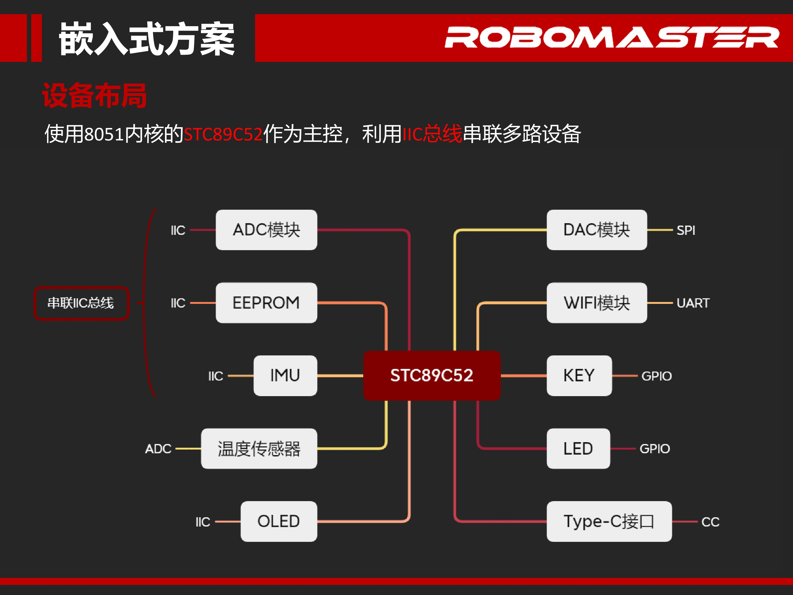
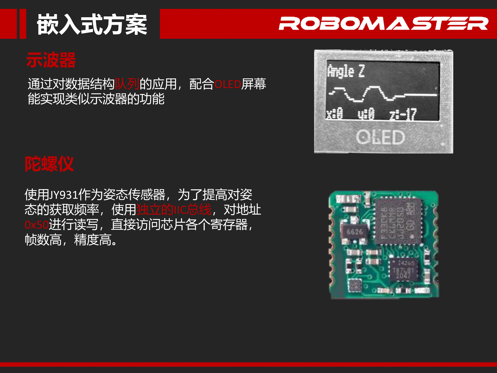

# HwxLink
This design aims to realize a miniaturized integrated multifunctional intelligent terminal, so it is proposed that the design is capable of accomplishing the following functions:
-	High-precision attitude sensing capability
-	Intelligent device control terminal
-	Wireless external sensor
-	Intelligent temperature detection
-	Portable DDS system
-	Simple Oscilloscope

# Repository Structure
```plaintext
HwxLink/
│
├── README.md
├── LICENSE
├── hardware/              # Hardware-related design
│   ├── pcb_layout/        # PCB design files
│   └── 3d_models/         # 3D models (if there are case designs, etc.)
│
├── software/              # Software-related code
│   ├── HwxLink_Version_3/ # Firmware code (embedded development)
│
├── words/                 # Reports and documentation
│   ├── design_report/     # Design report
│   ├── presentation/      # Design presentation
│   └── datasheets/        # Datasheets (chip or module-related documents)
│
└── images/                # Images and diagrams
    └── diagrams/          # Design diagrams, schematics.
```
# Design details







